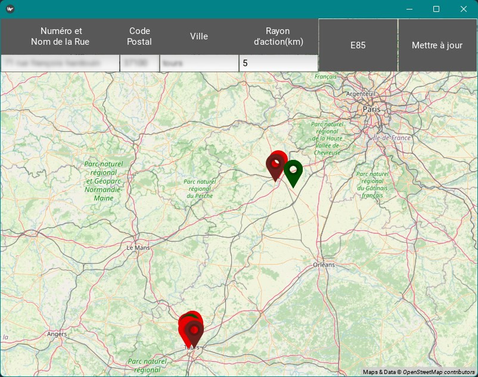
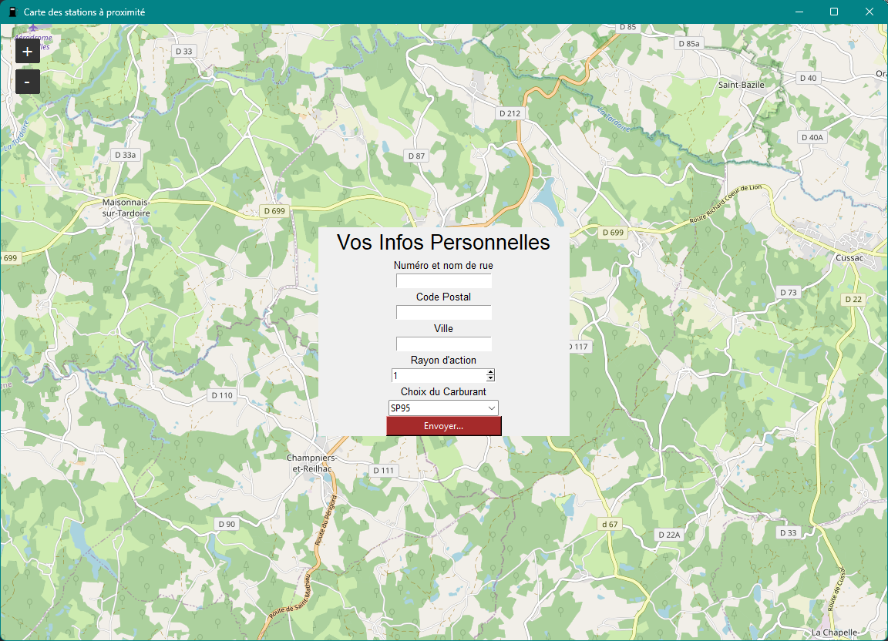

# Low Fuel     
     
     
Envoi de notification si le prix du carburant baisse (utilisation des données gouvernementales)     
     
     
     
         
Si vous voulez test    
Vous pouvez tester la version en cours de dev :    
[Low-Fuel Downloads](https://github.com/Bit-Scripts/Low-Fuel/releases/tag/1.2)    

Nouvelle Fonctionnalité : l'ajout de plusieurs requêtes en même temps   
     
      
une première version avec tkinter a été réalisé :     
       
     