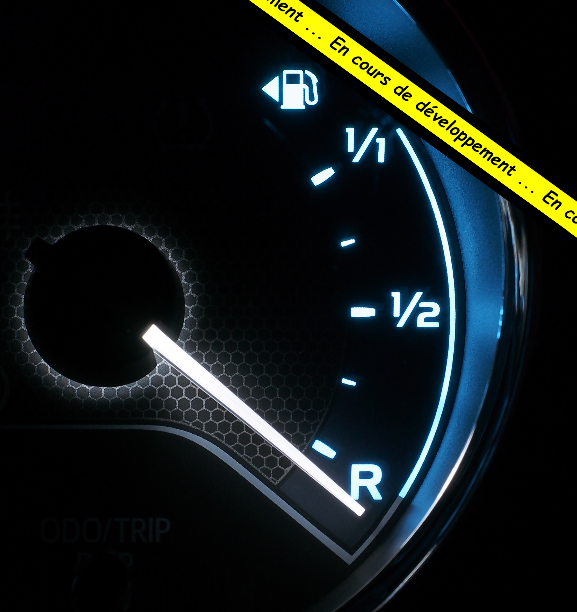
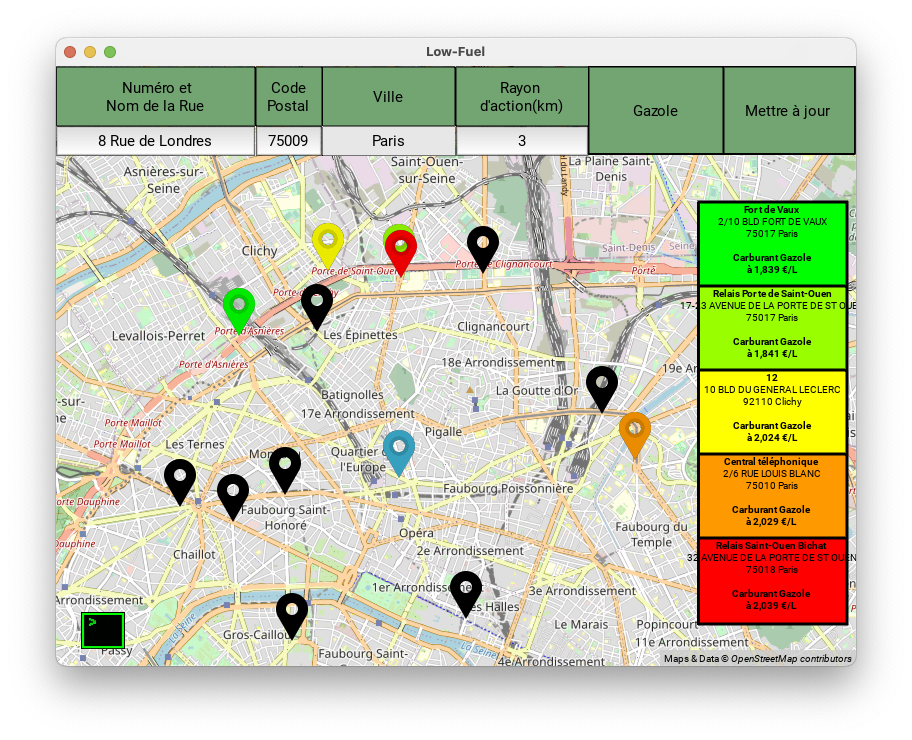

# Low Fuel     
     
     
Savoir où le prix des carburants est le moins cher (utilisation des données gouvernementales)     
     
     
     
         
Pour obtenir la dernière version suivez ces liens :    
[Low-Fuel Windows 64 bits](https://github.com/Bit-Scripts/Low-Fuel/releases/download/1.3/Low-Fuel_win64.exe)    
[Low-Fuel Linux 64 bits](https://github.com/Bit-Scripts/Low-Fuel/releases/download/1.3/Low-Fuel_Linux)    
[Low-Fuel MacOS Puce Silicon Apple ou Intel 64 bits](https://github.com/Bit-Scripts/Low-Fuel/releases/download/1.3/Low-Fuel_macOS.zip)    

     

Les nouveautés sont l'ajout de plusieurs requêtes les unes à la suite des autres et un nouveau code couleur :
* en bleu l'adresse entrée par l'utilisateur,      
* une échelle du vert au rouge, étant un classement de cinq stations services de la moins chère à la plus chère en fonction de l'adresse, du carburant et du rayon d'action.     
* et finalement des points en noirs représentants toutes les autres stations services     
